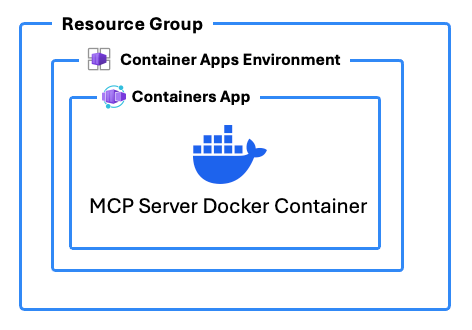

# powergentic/azd-mcp-ts 

An `azd` template to deploy a [Model Context Protocol (MCP)](https://modelcontextprotocol.io) server written in TypeScript to Azure Container Apps using SSE Transport.

To use this template, follow these steps using the [Azure Developer CLI](https://learn.microsoft.com/azure/developer/azure-developer-cli/overview):

1. Log in to Azure Developer CLI. This is only required once per-install.

    ```bash
    azd auth login
    ```

2. Initialize this template using `azd init`:

    ```bash
    azd init --template powergentic/azd-mcp-ts
    ```

3. Use `azd up` to provision your Azure infrastructure and deploy the web application to Azure.

    ```bash
    azd up
    ```

4. Once the template has finished provisioning all resources, and Azure Container Apps has completed deploying the app container _(this can take a minute or so after `azd up` completes to finish)_, the MCP server will be running.

    

5. To verify the MCP server is running, navigate your browser to the `/sse` url for the app within your browser.

    Example URL:

    ```text
    https://ca-mcp-vnv7lqmg46722.bravebeach-29a82758.eastus2.azurecontainerapps.io/sse
    ```

    This will open a streaming output within the browser that will look similar to the following:

    

6. **Congratulations**, you now have a simple MCP Server written in TypeScript up and running in Azure! You can now customize this app to build the specific MCP server you need for your AI solution.

## Architecture Diagram



In addition to deploying Azure Resources to host the MCP server, this template includes a `DOCKERFILE` that builds the MCP server app with TypeScript.

## Azure Resources

These are the Azure resources that are deployed with this template:

- **Container Apps Environment** - The environment for hosting the Container App
- **Container App** - The hosting for the MCP server app
- **Log Analytics** and **Application Insights** - Logging for the Container Apps Environment
- **Container Registry** - Used to deploy the custom Docker container for the app

## Author

This `azd` template was written by [Chris Pietschmann](https://pietschsoft.com), founder of [Powergentic.ai](https://powergentic.ai), Microsoft MVP, HashiCorp Ambassador, and Microsoft Certified Trainer (MCT).
